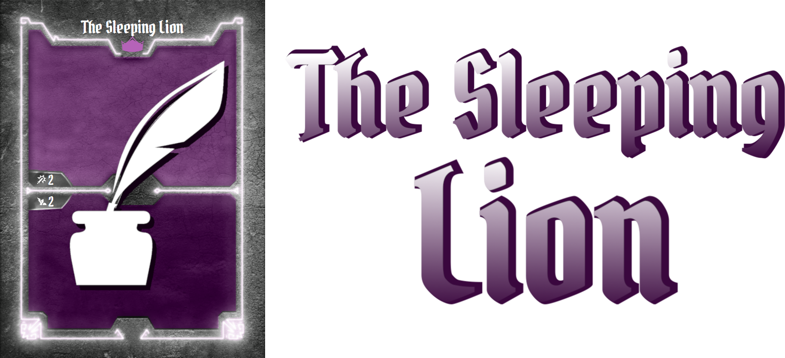

Have you ever wanted to create you own custom Gloomhaven character? Do you wish there was a simple way to create beautiful cards for the class you are designing? Maybe you don't know how to use graphics editors to their best and would like to focus on class mechanic, but not bother with the graphic layout?

Good news then: just head to over to **The Sleeping Lion** and find out about the starting mercenaries getting ready to head for adventure!

**The Sleeping Lion** allows you to create normalized Gloomhaven cards for custom classes. It is essentially a parser converting a Gloomhaven Markdown Language (GML) file to a PDF or PNG file.

The Gloomhaven Markdown Language (GML) is a laconic way to easily describe cards by using text. They are saved with the extension **.gml**. Since these files are basically text files, they are quite small in size (only a few kilobytes) and are therefore easily sharable: perfect if your are working with someone else on a custom class!

**The Sleeping Lion** also comes with an interactive visual interface to help you design your cards. This interface allows you to easily create, edit and export GML files and also shows a preview of the cards you are designing.

Before creating your cards, make sure to check the tutorial to use this software at its best.

Here are a few examples of what the cards look like when they are created using The Sleeping Lion:
- [Spellweaver's cards](https://github.com/GVigne/TheSleepingLion/raw/main/src/thesleepinglion/docs/Spellweaver.pdf)

# Installing The Sleeping Lion
## Windows users

For Windows, you can simply use [this binary](https://github.com/GVigne/TheSleepingLion/raw/main/TheSleepingLion_WindowsInstaller.exe) (you do not need to have Python installed).

Of course, you can also install The Sleeping Lion in a Python environment by following the instructions below.

## Linux users
### Dependencies
The Sleeping Lion depends on PyGObject and manimpango, which require non-python dependencies. You can install those dependencies by running

`sudo apt install libgirepository1.0-dev gcc libcairo2-dev pkg-config python3-dev gir1.2-gtk-3.0 libpango1.0-dev`

You can find the PyGObject install documentation [here](https://pygobject.readthedocs.io/en/latest/getting_started.html) and the manimpango documentation [here](https://pypi.org/project/ManimPango/).

### The Sleeping Lion

The Sleeping Lion is distributed though PyPi and can simply be installed using pip:

`pip install thesleepinglion`

You can also install it from source by downloading this repository and running:

`pip install .`

Once installed, just run `thesleepinglion` to launch the graphical interface.

# Documentation
- You will find [here](https://github.com/GVigne/TheSleepingLion/raw/main/src/thesleepinglion/docs/tutorial.pdf) a short tutorial explaining how to get started with The Sleeping Lion.
- A list of available functions can be found [here](https://github.com/GVigne/TheSleepingLion/raw/main/src/thesleepinglion/docs/available_functions.pdf).
- You can find the .gml file corresponding to the Spellweaver's cards [here](https://github.com/GVigne/TheSleepingLion/raw/main/src/thesleepinglion/docs/Spellweaver.gml). The corresponding output PDF can be found [here](https://github.com/GVigne/TheSleepingLion/raw/main/src/thesleepinglion/docs/Spellweaver.pdf).
- Similarly, you will find the Demolitionist's cards [here](https://github.com/GVigne/TheSleepingLion/raw/main/src/thesleepinglion/docs/Demolitionist.gml), and the output PDF [here](https://github.com/GVigne/TheSleepingLion/raw/main/src/thesleepinglion/docs/Demolitionist.pdf). This example includes enhancement dots and divider lines, and also highlights some of The Sleeping Lion's limits.
- The FAQ for The Sleeping Lion can be found [here](https://github.com/GVigne/TheSleepingLion/raw/main/src/thesleepinglion/docs/FAQ.md).
- If you want to help develop The Sleeping Lion, or want to know what is happening behind the scenes, check out [this document](https://github.com/GVigne/TheSleepingLion/raw/main/src/thesleepinglion/docs/advanced_topics.pdf) about some advanced topics!

# Acknowledgements
I would like to thank Isaac Childres for releasing the assets, and for his interest in developping an active community around Gloomhaven. This project, and in general the creation of custom Gloomhaven classes would not have been possible without his cooperation.

I would also like to thank Matthieu Vigne for his support and help throughout this project. The Sleeping Lion would never have made it without you.

Credits go to Alex Vigne for The Sleeping Lion's icon. Thanks!
